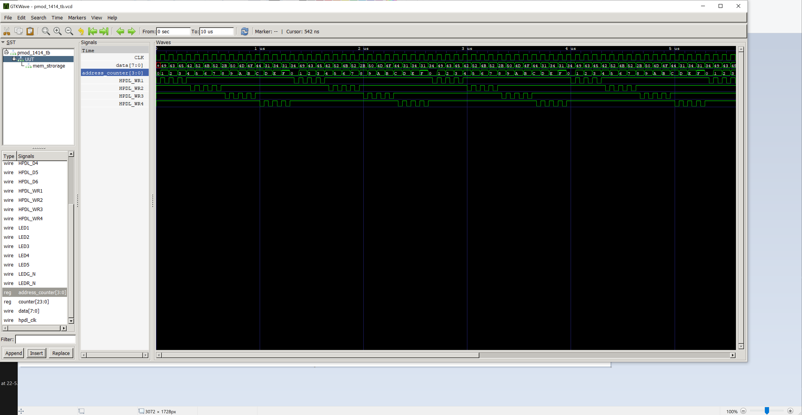
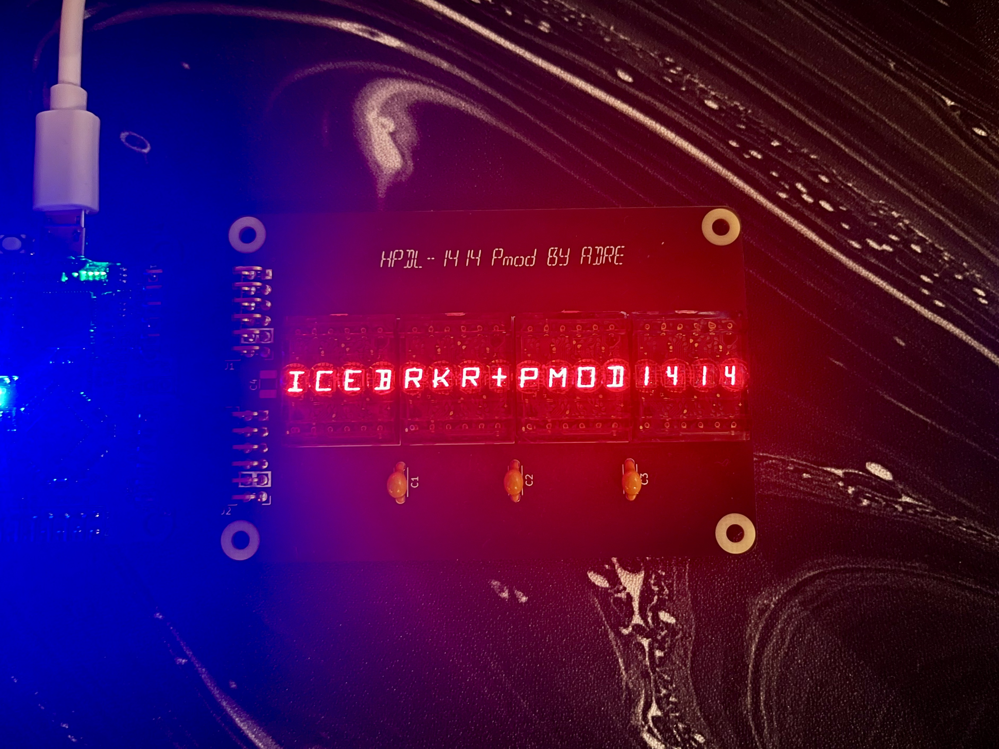

## Timing diagram for hpdl-1414 display modules 
Data, 
Address counter used for display  place address  and active #wrline 

## Demo display board connected to the icebreaker board vi 2 PMOD connection
Data send from uart 

sending data from via uart/com   override ride the initial message till it reaches position 16, after it shifts out to the right. 